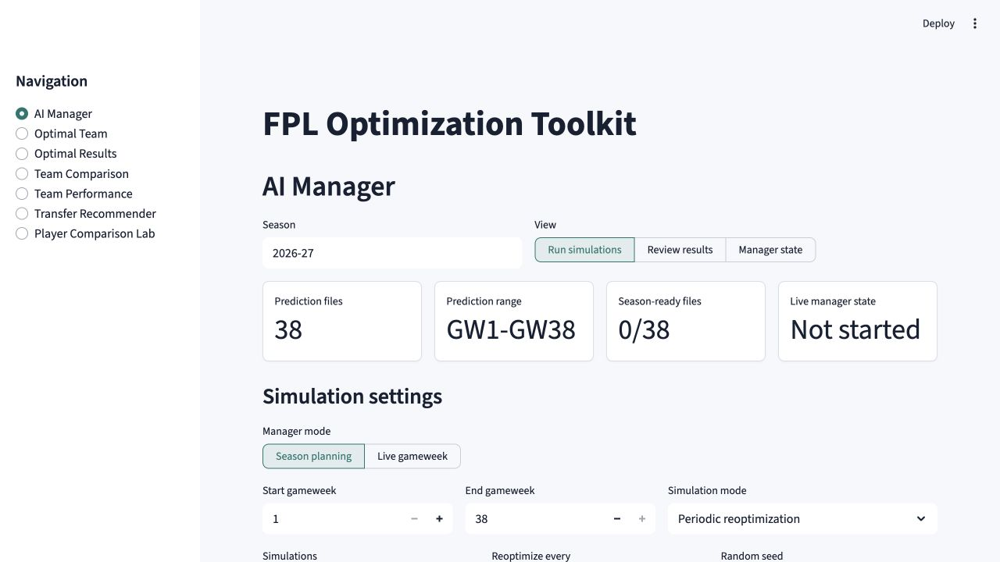
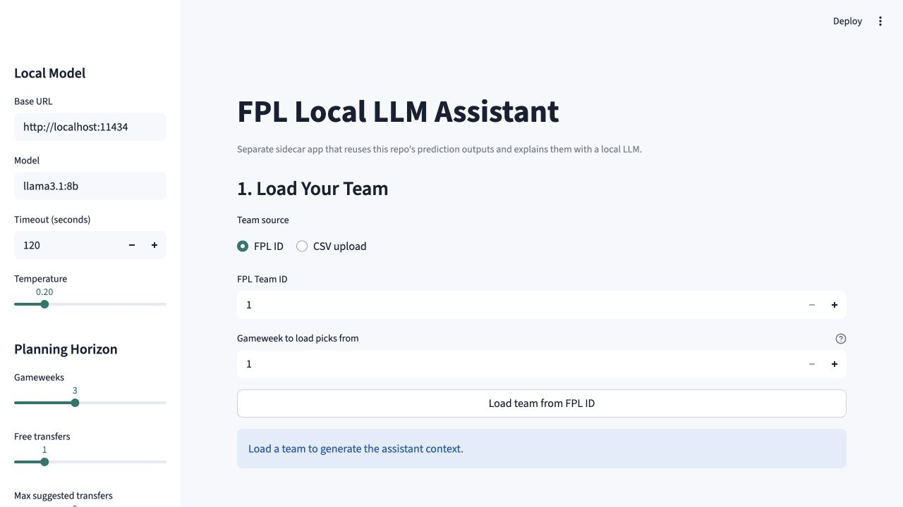
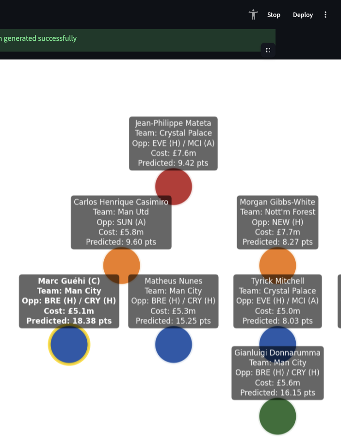
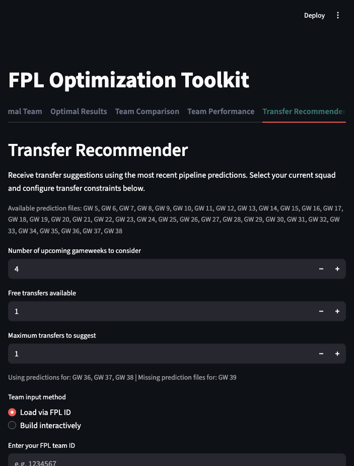

# FPL Expected Points Pipeline

Automated Fantasy Premier League analytics pipeline that ingests raw data, engineers features, trains ML models, updates bias adjustments, and outputs next gameweek projections alongside an optimized squad selection. A companion Streamlit interface (“FPL Optimization Toolkit”) visualizes the official next gameweek, confidence-aware predictions, user squad comparisons, and transfer recommendations.

---

## 1. System Overview

The pipeline is structured so each stage feeds the next while persisting intermediate artefacts for later inspection or incremental reruns:

1. **Logging/bootstrap** – capture run metadata and initialise logging.
2. **External data ingestion**
   - Official FPL API (bootstrap, fixtures, per-player histories).
   - Optional historical CSVs from the `vaastav/Fantasy-Premier-League` GitHub repo.
3. **Feature engineering** – derive rolling windows, lags, opponent strength context, set-piece indicators, and bias features.
4. **Model selection and training** – compare multiple estimator families (histogram gradient boosting, random forest, MLP, XGBoost with optional GPU support), fit each candidate, and retain both the selected pair and the full set for ensembling.
5. **Prediction** – score every fitted model, average their expected-point outputs into an ensemble forecast, apply fixture multipliers, and attach confidence diagnostics.
6. **Evaluation & bias update** – score the most recently completed gameweek, update EMA-based player and positional residual corrections.
7. **Squad optimization** – construct the best XI plus bench via mixed-integer optimization subject to FPL constraints.
8. **Outputs** – write predictions, squads, residuals, manager jobs, and logs to disk.

### 1.1 AI Manager

The **AI Manager** runs through the main Streamlit app and manages a full FPL season. It uses repeated simulations to choose the squad, transfers, lineup, bench, captain, vice-captain, and chip timing while tracking bank, purchase prices, free transfers, and saved live state.

Generate prediction artifacts, launch the main toolkit, and open **AI Manager**:

```bash
python main.py
streamlit run streamlit_app.py
```



See the [AI Manager season runbook](docs/ai-manager-season.md) for the end-to-end workflow and [season manager design notes](docs/season-manager.md) for the simulation modes and rules.

### 1.2 Local LLM FPL Assistant

The **Local LLM FPL Assistant** is a separate Streamlit app that uses a local Ollama-compatible model to explain the pipeline's deterministic squad analysis, player comparisons, and transfer recommendations in conversational language. It can load a squad by FPL ID or CSV and can optionally add current injury or availability search context.

Generate prediction artifacts, start your local Ollama server, and launch the assistant:

```bash
python main.py
streamlit run local_llm_fpl_assistant/app.py
```



See the [Local LLM FPL Assistant guide](local_llm_fpl_assistant/README.md) for model setup, supported inputs, and usage details.

---

## 2. Repository Layout

```
FPL-Prediction/
├── data/
│   ├── raw/          # API caches (bootstrap, fixtures, per-player histories)
│   ├── processed/    # intermediate cleaned data
│   └── external/     # cloned vaastav repo
├── fplmodel/
│   ├── config.py               # configurable constants (paths, model params, EMA alpha, etc.)
│   ├── data_pull.py            # HTTP pulls + caching logic
│   ├── data_cleaning.py        # normalise bootstrap and stack player histories
│   ├── external_history.py     # loader for historic CSV seasons
│   ├── features.py             # feature engineering functions
│   ├── model.py                # candidate builders, tuning, training, prediction helpers
│   ├── evaluation.py           # residual computation and EMA bias updates
│   ├── team_picker.py          # ILP squad optimization
│   ├── transfer_recommender.py # multi-GW projections + transfer suggestions
│   ├── season_manager.py       # stateful full-season manager simulation
│   ├── manager_jobs.py         # persistent background simulation workers
│   ├── manager_dashboard.py    # Streamlit AI Manager page
│   ├── team_analysis.py        # squad summaries and comparisons
│   ├── state.py / utils.py / logging_utils.py
│   └── display.py              # squad visualisation
├── models/                     # persisted models and state.json
├── outputs/                    # csv/json/png artefacts per run
├── docs/screenshots/            # README screenshots of the Streamlit toolkit
├── logs/                       # detailed run logs
├── local_llm_fpl_assistant/    # separate Ollama-backed conversational assistant
├── main.py                     # orchestrates the full pipeline
├── streamlit_app.py            # FPL Optimization Toolkit UI
└── requirements.txt
```

---

## 3. Installation & Execution

```bash
python -m venv .venv
source .venv/bin/activate  # Windows: .venv\Scripts\activate
pip install -r requirements.txt

python main.py              # runs the full pipeline
```

To include historical CSVs from the vaastav archive, clone the repo into `data/external/Fantasy-Premier-League` (matching the default path in `config.py`). The official player endpoint exposes only the current season, so this external dataset is required for a useful preseason GW1 cold start.

After a season ends, update that archive with `git -C data/external/Fantasy-Premier-League pull --no-rebase origin master`. Preseason runs verify that all 38 gameweeks of the immediately prior season are present.

Adjustments to paths, feature toggles, and model settings live in `fplmodel/config.py`.

### 3.1 Gameweek Overrides & Replay
- Single backdated run: `python main.py --override-last-finished-gw 4 --override-next-gw 5`
- Sequential rebuild (example GW5–7):

  ```bash
  python main.py --force-refetch --replay-start-gw 5 --replay-end-gw 7
  ```

- Only the first replay iteration honours `--force-refetch`; later runs reuse cached data.
- Overrides let you reconstruct history so EMA biases in `models/state.json` evolve just as they would week by week.
- Without overrides the pipeline relies on live `bootstrap-static` metadata to infer the current, next, and last finished gameweeks automatically.
- Live bootstrap and fixture caches expire after 15 minutes. The pipeline also checks that API deadlines match the season implied by today's date; use `--expected-season 2026-27` explicitly at launch or when selecting another season intentionally.

### 3.2 Generating Future Projections
The Streamlit transfer recommender expects prediction files for the next horizon (e.g., GW8–GW12). After running the live pipeline, replay the upcoming gameweeks:

```bash
python main.py --force-refetch --replay-start-gw 8 --replay-end-gw 12
```

This writes `outputs/predictions_gw8.csv` through `outputs/predictions_gw12.csv`, along with best XI JSON/PNG artefacts, enabling multi-week app projections.

### 3.3 Simulating A Full FPL Manager
The season manager adds the stateful layer above one-week predictions: initial squad, weekly transfers, free-transfer carryover, captain, vice-captain, chips, player purchase prices, FPL sale values, bank, team value, and repeated uncertainty-aware simulations. See `docs/season-manager.md` for design notes, `docs/ai-manager-season.md` for the season runbook, or open `manager_test.ipynb` to run and inspect the manager output in notebook form.

For a quick notebook run:

```bash
jupyter notebook manager_test.ipynb
```

If Jupyter is not available in your active environment, install or launch it from the environment you normally use for notebooks, then select the project Python environment as the kernel.

When it is time to run the actual new season:

1. Update the upstream data after FPL prices, teams, fixtures, and GW1 metadata are live:

   ```bash
   python main.py --force-refetch --expected-season 2026-27 --override-next-gw 1 --override-last-finished-gw 0
   ```

2. Generate enough future prediction files for the manager horizon. For a full-season planning pass, generate every available future gameweek:

   ```bash
   python main.py --expected-season 2026-27 --replay-start-gw 1 --replay-end-gw 38
   ```

3. Launch `streamlit run streamlit_app.py`, open **AI Manager**, and select:
   - **Season to simulate**: `2026-27`
   - **Season planning**
   - GW1 through GW38
   - 50,000 simulations
   - **Periodic reoptimization** with an interval of 1,000

   The page uses the season found in the cached FPL deadlines. If it still shows
   the prior season, the new game is not available to the pipeline yet. Legacy
   prediction files can be validated and tagged from the page only when their
   players and clubs match that cached season.

   Each pipeline run also saves its prediction under
   `outputs/seasons/<season>/` with the matching gameweek bootstrap snapshot.
   The season selector lists those retained archives, so creating a newer season
   no longer overwrites the manager's access to an older one. Only seasons with
   generated prediction files are selectable.

4. Check `SeasonRules` in `fplmodel/season_manager.py` before trusting a live run. FPL chip and free-transfer rules can change by season.

5. Run the manager and review:
   - simulation summary
   - recommended-policy weekly decisions
   - transfer table
   - chip timing
   - GW1 squad

---

## 4. Detailed Pipeline Walkthrough

### 4.1 Logging and Preparation
- `main.py` initialises a run-specific logger via `fplmodel.logging_utils.configure_run_logger`.
- `get_current_and_last_finished_gw` determines the next/open gameweek and the most recently completed one (using `events` from bootstrap).
- If `MAX_TRAIN_GW` is set, it caps the training horizon.

### 4.2 Data Ingestion
1. **Bootstrap static** (`fetch_bootstrap_static`)  
   Yields player metadata, team information, chip stats, and events.
2. **Fixtures** (`fetch_fixtures_all`)  
   Full schedule including future double/blank GWs.
3. **Player histories** (`bulk_fetch_player_histories`)  
   Pulls current-season per-match history arrays for each player. The official API does not accept a season selector for this endpoint.
   - Files cached under `data/raw/player_<id>.json`.

4. **External history ingestion** (`external_history.load_external_histories`)  
   Attaches vaastav CSV seasons listed in `EXTERNAL_HISTORY_SEASONS`. Historical element IDs are season-specific, so rows are mapped to current players through stable player codes.

### 4.3 Data Cleaning
- `data_cleaning.normalize_bootstrap` normalises bootstrap structures into pandas DataFrames (`elements`, `teams`, `events`).
- `data_cleaning.build_master_history` merges API histories plus optional external data into a unified match-level table.

### 4.4 Feature Engineering
- `features.build_training_and_pred_frames` produces:
  - Lagged + rolling windows for goals, assists, clean sheets, expected metrics.
  - Opponent strength metrics (team and opponent rolling form, expected goals conceded, set-piece roles).
  - Bias features (player- and position-level residual signals).
  - Binary indicators for availability, home/away, double/blank weeks.
  - Training metadata (season/gameweek timestamps) for time-aware CV & weighting.
- `expand_for_double_gw` multiplies expected points by fixture counts for double/blank adjustments while keeping per-model diagnostics.

### 4.5 Model Selection & Training (`model.train_models`)
- Candidate families: histogram gradient boosting (sklearn), random forest, MLP, XGBoost (optional GPU).
- Optional hyperparameter tuning (`ENABLE_HYPERPARAM_TUNING`) explores search spaces defined in `config.py`.
- Chronological TimeSeriesSplit CV replaces random folds whenever metadata permits, preventing look-ahead leakage.
- Per-season sample weights decay older campaigns (configurable via `SEASON_WEIGHT_DECAY` / `SEASON_WEIGHT_MIN`).
- Saves tuned models and metadata to `models/`.
- Logs feature importances (`log_model_feature_weights`) for inspection.

### 4.6 Prediction (`model.predict_expected_points`)
- Scores every player across the selected regressors/classifiers.
- Averages the raw outputs across models, re-applies EMA bias corrections (`player_bias`, `position_bias`), and clips at zero to produce the ensemble column used throughout the rest of the pipeline.
- Applies double/blank gameweek fixture multipliers. Double-gameweek players can therefore have materially higher one-week projections.
- Adds confidence diagnostics:
  - `start_probability` – classifier-estimated chance of a player reaching starter-level minutes.
  - `appearance_probability` – separate estimate of any minutes, used for DNPs, autosubs, and vice-captain fallback.
  - `confidence_score` / `confidence_level` – blended signal from model agreement, player availability, start probability, and recent-data reliability.
  - `expected_points_lower_80` / `expected_points_upper_80` – approximate 80% expected-points interval.
- Outputs `outputs/predictions_gw<N>.csv` containing season/gameweek metadata, per-model raw/corrected predictions, ensemble `expected_points`, fixture multipliers, and confidence fields.

### 4.7 Evaluation & Bias Update (`evaluation.evaluate_last_finished_gw_and_update_state`)
- Reconstructs “gw-1” feature rows for players who played in `last_finished_gw`.
- Predicts that finished GW, compares to actual total points.
- Computes residuals and updates `state.json` via exponential moving average (`EMA_ALPHA`).
  - Separate EMA per player and per position keeps future predictions calibrated.

### 4.8 Squad Optimization (`team_picker.pick_best_xi`)
- Formulates an integer linear program using PuLP:
  - Decision variables for each player (start, bench, captain).
  - Constraints: budget, formation options (`FORMATION_OPTIONS`), positional minimums, max three per club, total squad size (15) and bench order.
- Produces:
  - Starting XI with captaincy applied.
  - Bench ordering.
  - Expected-point totals with and without captain.
- Optionally annotates fixtures on the squad objects.

### 4.9 Artifact Generation
- Saves:
  - Predictions: `outputs/predictions_gw<N>.csv`.
  - Starting XI / Bench CSVs.
  - Full squad JSON.
  - Squad image (if `display.create_best_xi_graphic` succeeds).
  - Residuals CSV for `last_finished_gw`.
- Maintains run-specific logs under `logs/`.

---

## 5. Streamlit “FPL Optimization Toolkit”

Launch the UI after running the pipeline at least once:

```bash
streamlit run streamlit_app.py
```

The app auto-loads fixtures and prediction files from `outputs/`, checks live FPL `bootstrap-static` event metadata, and falls back to local cached metadata if the network is unavailable. Session state preserves your selections across pages so you can navigate without re-entering teams.

The **AI Manager** tab runs long simulations in a separate process. Progress, ETA, results, and the first recommended state are persisted under `outputs/ai_manager_jobs/`, so changing pages or reconnecting to Streamlit does not discard a run.

### 5.1 Screenshots

Optimal team view with confidence summary, squad metrics, and the prediction confidence board:



Transfer recommender setup showing the official next-gameweek horizon and missing future files:



### 5.2 AI Manager Page
- **Run simulations** configures planning or live mode, gameweek range, simulation count, policy refresh interval, uncertainty, strategy thresholds, and season rules. The manager still chooses the squad, transfers, chips, lineup, bench, captain, and vice-captain itself.
- **Review results** compares policy blocks and simulation totals, shows the recommended policy by gameweek, and displays the selected starting XI, bench, transfers, captaincy, chip, bank, and team value.
- **Manager state** shows the committed live squad, purchase prices, bank, free transfers, chip usage, and decision history.
- Only one background run is started from the UI at a time. It can be canceled from the active-run panel.
- Live state advances only after you select the completed run, confirm that its first decision was applied on the FPL website, and press **Save state through GW<N>**.

### 5.3 Optimal Team Page
- Automatically selects the official FPL `is_next` gameweek when that prediction file exists. If live event metadata is unavailable, the app falls back to cached metadata and then to the latest available prediction file.
- Assumes a £100.0m budget (captioned on the page) and displays:
  - Best XI image from `outputs/best_xi_gw<N>.png` (if present).
  - Metrics for expected points (with and without captain), captain, squad confidence, and squad costs.
  - Confidence summary for the whole prediction file: average confidence, average start probability, high-confidence player count, and watchlist volatility.
  - Prediction Confidence Board with the top projected players, confidence level, confidence percentage, start probability, and approximate 80% expected-points range.
  - Tables for starters and bench including  
    `Pos · Name · Team · Opponent · Cost (£m) · Expected CS · Expected A · Expected G · Expected Pts · Confidence · Conf % · Start Prob · 80% Range · Captain · Bench Order`.

### 5.4 Team Comparison Page
- Uses the same upcoming GW predictions.
- Team input methods:
  1. **Use saved team** – reuse the squad cached during the current session.
  2. **Load via FPL ID** – supply your FPL team ID; the app calls `https://fantasy.premierleague.com/api/entry/<id>/event/<last_finished_gw>/picks/` and infers captaincy automatically.
  3. **Upload CSV** – requires `player_id`; optional columns `full_name`, `starting`, `bench`, `captain` are honoured.
  4. **Build interactively** – choose players position-by-position inside the app.
- Displays:
  - Expected points for your squad vs. optimal, points gap, rating percentage.
  - Confidence fields for selected players when present in the prediction file.
  - Actual totals from the last finished GW for both teams (when historical data is present).
  - Tables with the same enriched columns listed above.
- Every submission updates session state, making the squad available to the Transfer Recommender without re-uploading.

### 5.5 Transfer Recommender Page
- Horizon selector defaults to four gameweeks (or fewer if limited prediction files exist).
- Multi-gameweek horizons start from the same official next-gameweek selector used by the Optimal Team and Team Comparison pages.
- Missing prediction files are listed explicitly so stale or incomplete future projections are visible.
- Team inputs mirror Team Comparison (saved team, FPL ID, CSV, interactive builder).
- Parameters:
  - Free transfers available.
  - Maximum transfers to suggest (capped by free transfers by default).
- Output:
  - Recommended swaps (position-aware) with expected points delta.
  - Metrics for transfers suggested, free transfers used, additional hits, and “Optimal projected points with transfers” across the selected horizon.
  - Projection tables for:
    1. Current squad.
    2. Squad after applying recommended transfers.
    3. Optimal squad over the same horizon.
  - Confidence level, confidence percentage, and start probability for players where the first gameweek in the horizon provides those fields.

### 5.6 Player Comparison Lab
- Multi-player selector combines upcoming prediction horizons with historic stats to show players in context.
- Projection summary table highlights total expected points across the chosen gameweek window plus average expected points per GW.
- Skill radar charts plot `expected_goals_per_90`, `expected_assists_per_90`, `clean_sheets_per_90`, and average expected points so you can see complementary profiles at a glance.
- Expected vs. actual scatter graphs surface calibration gaps for any finished gameweek.
- Gameweek timelines track expected points per player across the horizon, alongside a fixture difficulty table that colours upcoming opponents by strength.

#### Notes on FPL ID Usage
- Find your ID in the FPL website URL (`/entry/<id>/`).
- Picks must exist for the last finished GW; otherwise the API returns an error surfaced by the app.
- Session cache stores `(FPL ID, gameweek)` pairs to avoid redundant HTTP calls during a session.

---

## 6. Configuration Highlights

- `config.py` contains most knobs:
  - **Paths** (`RAW_DIR`, `OUTPUTS_DIR`, etc.)
  - **Historical depth** (`EXTERNAL_HISTORY_SEASONS`; the official player endpoint is current-season only)
  - **Model tuning** (`ENABLE_HYPERPARAM_TUNING`, distributions)
  - **Bias behaviour** (`EMA_ALPHA`, ability to clamp in `state.py`)
  - **Optimization constraints** (budget, formations, positional limits)
  - **GPU usage** (`ENABLE_GPU_TRAINING`)
- Update those constants directly in `config.py`, or layer your own environment-variable handling around it if you need runtime overrides.
- `models/state.json` is season-tagged. Biases continue within a season and reset automatically when the bootstrap season changes.

---

## 7. Development Tips & Troubleshooting

- Use `main.py` as the orchestrator; modules are decoupled enough to run individually for testing (e.g., call `features.build_training_and_pred_frames` in notebooks).
- Add unit tests for feature calculations or optimization constraints as the codebase evolves.
- Watch the logs:
  - Selected models and hyperparameters.
  - Bias updates (number of residuals applied).
  - Squad selection metrics and constraints.
- If projections look unrealistic, inspect:
  - The selected gameweek in Streamlit. The app should show the official FPL `is_next` gameweek; cached event metadata refreshes every five minutes and falls back to local `data/raw/bootstrap-static.json` when offline.
  - `fixture_multiplier` in `outputs/predictions_gw*.csv`; double-gameweek teams receive a multiplier greater than 1.0.
  - `models/state.json` for runaway biases.
  - `outputs/residuals_gw*.csv` for large residuals that feed the EMA.
  - Feature importances via the log entries from `log_model_feature_weights`.
- **Streamlit reload** – `streamlit run streamlit_app.py` hot-reloads code changes and respects cached squad selections in session state.
- **Missing projections** – ensure horizon files exist (rerun the pipeline with overrides). The Transfer Recommender lists missing future gameweeks directly.
- **FPL API errors** – confirm the FPL ID is correct and that the last finished GW has recorded picks.

---

## 8. Team Analysis & Programmatic APIs

- `fplmodel.team_analysis` introduces helpers to summarise a user squad and compare it against the optimizer’s recommended XI. Use `compare_team_to_optimal` when you have the model predictions for a given gameweek alongside the user’s roster.
- `fplmodel.transfer_recommender` aggregates predictions across upcoming gameweeks and proposes transfer moves that close the gap to the optimal squad while respecting the available free transfers. The Streamlit page showcases these utilities, but you can import the same functions in scripts or notebooks.
